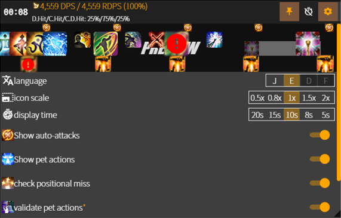

# kagami

*kagami* is **mirror** in Japanese.

show your FFXIV skill rotations with *kagami*, looking back your rotations with *kagami*!

## features🚀

- show player & pet actions.
- track player casting and its interrupt.
- melee positional(rear/flank) check
- pet actions validation
- show background grid
- change background color
  - Supports hex colors with and without transparency in the format of `#123456` `#12345678` `123456` `12345678`
  - **If using with ACT overlay plugin**
    - The hex color input will not work without the overlay locked
    - It will also not work if the game is taking keyboard input
  - **If using with OBS browser source**
    - The hex color input will work when interacting with the browser source
  - The current default BG color is `#3f3f3f82`  
  - The former default BG color was `#000000bb` 

## installation🔨

See [installation](https://github.com/sgosiaco/kagami/blob/master/installation.md).
current *kagami* works good with: FFXIV patch `6.11`

## known issues🚧

- cannot indicate pet before *kagami* launch
  (you have to re-summon your pet after launch *kagami*😥)
- item, mount icons are coming out later than expected timing
- bug on pet action validation when hitting low-level striking dummies

## upcoming features⚡

- theme customization

## contact💬

- discord `ram#5923` (japanese, english, korean)
- fork by discord `sgosiaco#4118`
- or make [issue](https://github.com/sgosiaco/kagami/issues) in this repository
- any PRs are welcome, especially:
  - DE, FR language
